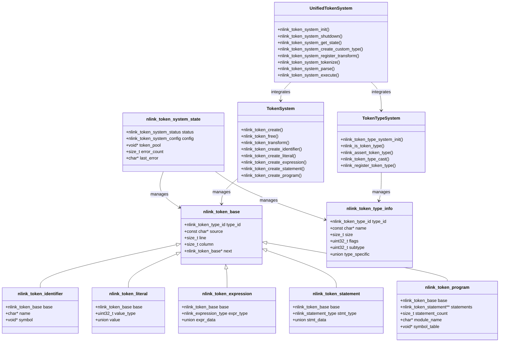

```mermaid
classDiagram
    class nlink_token_base {
        +nlink_token_type_id type_id
        +const char* source
        +size_t line
        +size_t column
        +nlink_token_base* next
    }
    
    class nlink_token_identifier {
        +nlink_token_base base
        +char* name
        +void* symbol
    }
    
    class nlink_token_literal {
        +nlink_token_base base
        +uint32_t value_type
        +union value
    }
    
    class nlink_token_expression {
        +nlink_token_base base
        +nlink_expression_type expr_type
        +union expr_data
    }
    
    class nlink_token_statement {
        +nlink_token_base base
        +nlink_statement_type stmt_type
        +union stmt_data
    }
    
    class nlink_token_program {
        +nlink_token_base base
        +nlink_token_statement** statements
        +size_t statement_count
        +char* module_name
        +void* symbol_table
    }
    
    class nlink_token_type_info {
        +nlink_token_type_id type_id
        +const char* name
        +size_t size
        +uint32_t flags
        +uint32_t subtype
        +union type_specific
    }
    
    class nlink_token_system_state {
        +nlink_token_system_status status
        +nlink_token_system_config config
        +void* token_pool
        +size_t error_count
        +char* last_error
    }
    
    nlink_token_base <|-- nlink_token_identifier
    nlink_token_base <|-- nlink_token_literal
    nlink_token_base <|-- nlink_token_expression
    nlink_token_base <|-- nlink_token_statement
    nlink_token_base <|-- nlink_token_program
    
    nlink_token_system_state --> nlink_token_base : manages
    nlink_token_system_state --> nlink_token_type_info : manages
    
    class TokenTypeSystem {
        +nlink_token_type_system_init()
        +nlink_is_token_type()
        +nlink_assert_token_type()
        +nlink_token_type_cast()
        +nlink_register_token_type()
    }
    
    class TokenSystem {
        +nlink_token_create()
        +nlink_token_free()
        +nlink_token_transform()
        +nlink_token_create_identifier()
        +nlink_token_create_literal()
        +nlink_token_create_expression()
        +nlink_token_create_statement()
        +nlink_token_create_program()
    }
    
    class UnifiedTokenSystem {
        +nlink_token_system_init()
        +nlink_token_system_shutdown()
        +nlink_token_system_get_state()
        +nlink_token_system_create_custom_type()
        +nlink_token_system_register_transform()
        +nlink_token_system_tokenize()
        +nlink_token_system_parse()
        +nlink_token_system_execute()
    }
    
    TokenTypeSystem --> nlink_token_type_info : manages
    TokenSystem --> nlink_token_base : manages
    UnifiedTokenSystem --> TokenTypeSystem : integrates
    UnifiedTokenSystem --> TokenSystem : integrates
```